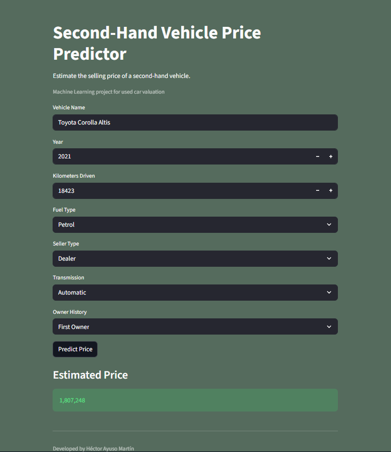

# Second-Hand Vehicle Price Forecasting

Machine Learning project focused on predicting the selling price of used vehicles based on real market attributes such as brand, age, mileage, fuel type and ownership history.

The data used is oriented toward the Indian second-hand vehicle market, and the monetary unit is rupees. For price forecasting in the European or Spanish market, the model presented below would not be useful.

Built with Python and deployed locally through a Streamlit.

The dataframe was obtained from Kaggle.

Authorship: Héctor Ayuso Martín
Linkedin: https://www.linkedin.com/in/hector-ayuso-martin/

---

## Demo



---

## Launch App

What it does exactly:
If .venv does not exist, it creates it.
If it already exists, it does not modify it.
It tries to import all the key libraries.
If any are missing, it runs pip install -r requirements.txt.
If they are already installed, it launches Streamlit app directly.

## Overview

The objective of this project is to estimate second-hand vehicle prices using supervised regression models trained on structured automotive market data.

The workflow includes:

- Exploratory Data Analysis (EDA)
- Feature Engineering
- Data Preprocessing
- Model Training & Evaluation
- Saved Inference Pipeline
- Interactive Streamlit App

---

## Features

Input variables:

- Vehicle name
- Manufacturing year
- Kilometers driven
- Fuel type
- Seller type
- Transmission
- Ownership history

Output:

- Estimated selling price

---

## Tech Stack

- Python
- Numpy
- Pandas
- Scikit-learn
- CatBoost
- XGBoost
- Streamlit
- Matplotlib
- Seaborn
- Joblib

---

## Project Structure

```text
app/
    streamlit_app.py

data/
    .csv from kaggle

media/
    multimedia files
    
src/
    config.py
    data_loader.py
    train.py
    predict.py
    preprocessing.py
    features.py
    evaluate.py
    utils.py

models/
    trained model artifacts

notebooks/
    EDA and experimentation notebook

info/
    Miscellaneous information about the project.
